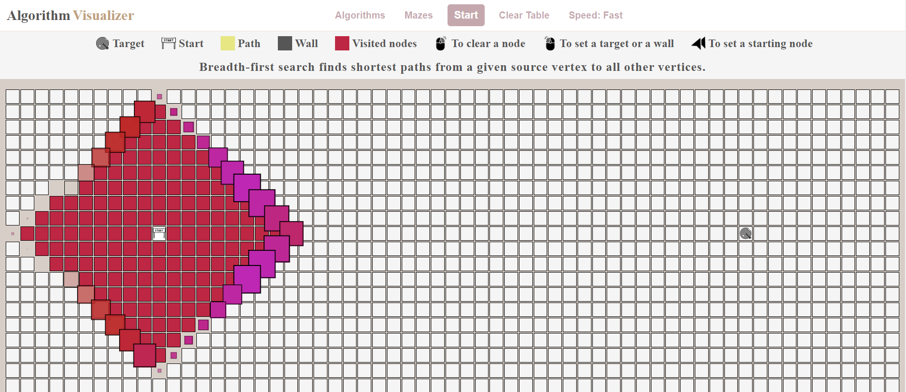
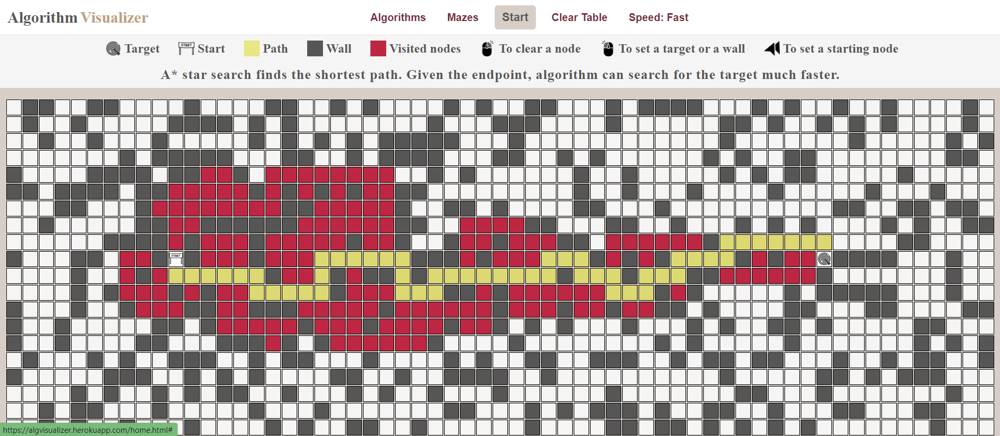

# Algorithm Visualizer

## Idea

Project shows the working principles of several graph search algorithms and lets a user to play with it as well as create different obstacles for an algorithm.

Project also features maze generators if user doesn't want to set up obstacles themselves.

## Algorithms featured

* Depth first
* Breadth first 
* A* star 
* Dijkstra's algorithm

## Description

The project has a tutorial which can guide a user through necessary features on the page. Tutorial can be skipped if a user wants to enjoy visualization right away.

To play with the algorithms you can [here](https://algorithm-visualizer.onrender.com/)

### Note!

<i>App is deployed on heroku and used for educational purposes only.</i>